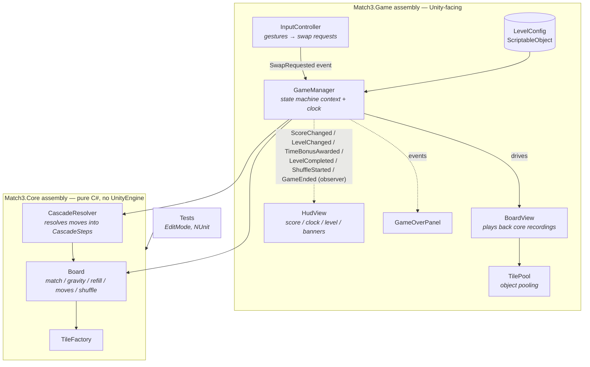
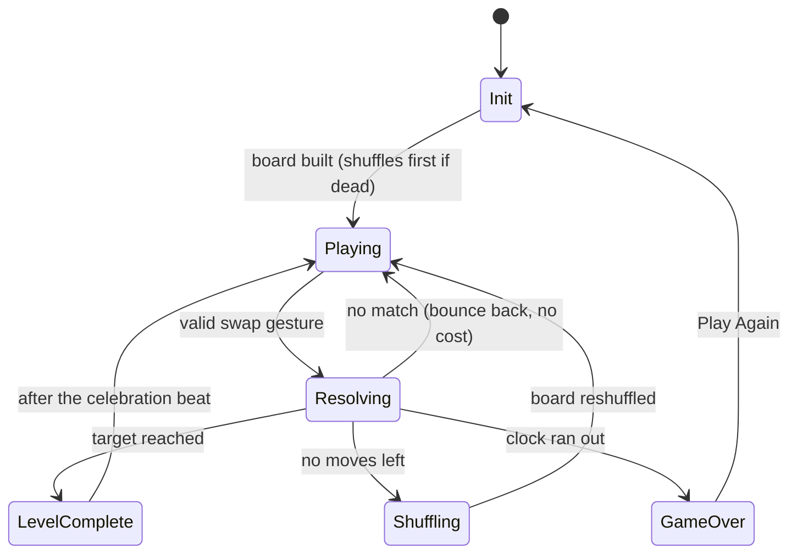

# Match-3 — a small Unity time-attack puzzle built for architecture

A complete, mobile-portrait match-3 with an **endless time-attack** loop: race a
countdown to hit each level's target score, earn bonus seconds for big matches, and
climb levels until the clock beats you. Deliberately small in scope so the focus stays
on **code architecture** — an engine-free, unit-tested C# core, a thin MonoBehaviour
view layer, and classic design patterns used where they pull their weight.

> 🎬 *gameplay GIF placeholder — record with Cmd+Shift+5 on macOS and drop it here as `docs/gameplay.gif`*

```

```

**Stack:** Unity 2022.3 LTS · 2D URP · TextMeshPro · Unity Test Framework (NUnit) ·
no third-party assets, all "juice" is hand-rolled coroutine tweens.

## Gameplay

- **8×8 board, five colours.** Drag a tile onto a neighbour to swap; 3+ in a line clears.
- **Time attack.** A countdown (default 45s) per level; reach the target score (default
  120) before it hits zero. No move limit — a swap only costs the clock.
- **Cascades & combos.** Cleared tiles fall, new ones pour in from the top; chain
  reactions score at a rising multiplier.
- **Bonus time.** Every match of 4+ in a line adds seconds to the clock (default +5s),
  with a green flash on the timer.
- **Endless levels.** Clear the target → a "Level Complete!" beat (board wipes out and
  the *same* arrangement pops back) → the next level with a higher target and a fresh clock.
- **No-moves recovery.** If the board has no possible move, it auto-shuffles into a
  guaranteed-playable layout.
- **Idle hint.** Sit still for a few seconds and a still-available move pulses.

Every number above lives in one `LevelConfig` asset — tune the feel without touching code.

---

## Architecture

The rule of the codebase: **logic decides, views obey.** All game rules live in
`Match3.Core`, a separate assembly compiled with `noEngineReferences: true` — the
compiler physically rejects `using UnityEngine` there. MonoBehaviours render, animate
and forward input; they never decide anything.



A player move flows one way: `InputController` raises an event → the current
`GameState` validates it → `CascadeResolver` mutates the `Board` and returns a
**recording** (`CascadeStep[]`: what cleared — with per-run lengths for the bonus —
what fell, what spawned, wave by wave) → `BoardView` animates the recording → C# events
update the HUD. The view never re-derives rules, so logic and presentation can't drift apart.

### Game flow (State pattern)



Each phase is its own class. Two payoffs of the pattern show up directly:
- **Input is ignored while animations play** with *no* boolean flag — `ResolvingState`,
  `LevelCompleteState` and `ShuffleState` simply don't handle swaps.
- **The clock auto-pauses between levels and during a shuffle** — `GameManager.Update`
  only ticks the timer in `Playing`/`Resolving`, so the paused states get a frozen clock
  for free.

## Design patterns used (and why)

| Pattern | Where | Why it earns its place |
|---|---|---|
| **State** | `Scripts/Game/States/` (Init, Playing, Resolving, LevelComplete, Shuffle, GameOver) | Each phase's behaviour and its input/clock rules live in one class; no `if (isBusy)` flags anywhere. |
| **Observer** (C# `event`) | `GameManager` → `HudView`, `GameOverPanel` | UI subscribes to score / level / bonus / level-complete / shuffle / game-over. GameManager has zero references to UI types — delete the HUD and the game still runs. |
| **Object Pool** | `Scripts/View/TilePool.cs` | Tiles clear and respawn constantly; pooling replaces Instantiate/Destroy churn (GC spikes = dropped frames on mobile) with a stack of reused views. |
| **Factory** | `Scripts/Core/TileFactory.cs` | Single creation point: unique tile IDs for view tracking, injected randomness for deterministic tests. |
| **ScriptableObject config** | `Scripts/Game/LevelConfig.cs` | Board size, time limit, target & per-level growth, bonus rules, hint delay and palette are a data asset — designers tune the game without touching code. |

Two supporting ideas: **dependency inversion** on randomness (`IRandom` is injected
into the factory *and* the shuffle, so tests script every dice roll), and **humble
views** (`TileView` knows only "which tile ID am I showing" — all animation targets
come from core data).

## Testing

The core is tested without ever opening a scene — match detection, gravity, refill,
cascade chains and multipliers, per-run lengths for the big-match bonus, and the
no-moves recovery (dead-board detection + a shuffle that stays match-free, playable,
and colour-preserving across many seeds).

```
Assets/Tests/EditMode/
├── MatchDetectionTests.cs   runs of 3/4, L-shapes counted once, no false positives
├── BoardTests.cs            no-match initial fill (30 seeds), swap mechanics, factory rules
├── GravityTests.cs          falling, identity preservation, refill stacking
├── CascadeResolverTests.cs  chain reactions, multipliers, board stability after resolve
├── MatchRunTests.cs         per-run lengths → big-match (4+) detection for bonus time
└── BoardRecoveryTests.cs    find-a-move, dead-board detection, colour-preserving shuffle
```

**74 tests, all green.** Run them in Unity via **Window → General → Test Runner →
EditMode → Run All**. Because the core is plain C#, the same files also compile and
pass under the .NET SDK with vanilla NUnit — no Unity install required:

```bash
dotnet test   # a csproj that links Assets/Scripts/Core + Assets/Tests/EditMode
```

## Project structure

```
Assets/
├── Scripts/
│   ├── Core/        ← Match3.Core.asmdef (noEngineReferences) — Board (match/gravity/
│   │                  refill/possible-move/shuffle), CascadeResolver, TileFactory,
│   │                  GridPosition, Tile, ScoreConfig, MatchRun/CascadeStep models
│   ├── Game/        ← GameManager, LevelConfig, States/ (Init, Playing, Resolving,
│   │                  LevelComplete, Shuffle, GameOver)
│   ├── View/        ← BoardView, TileView, TilePool, InputController, CameraFitter
│   └── UI/          ← HudView, GameOverPanel
├── Tests/EditMode/  ← NUnit tests for the core
├── Prefabs/ · Scenes/ · ScriptableObjects/ · Sprites/
```

## Run it

1. Clone, open with Unity 2022.3 LTS via Unity Hub.
2. Follow [SETUP.md](SETUP.md) for the one-time scene/prefab wiring (written for zero
   Unity experience).
3. Press Play: drag a tile towards a neighbour to swap. Reach the target before the
   clock runs out; chain 4+ matches for bonus time and climb the levels.

## Scope cuts (deliberate)

Kept out to keep the codebase reviewable in one sitting: special tiles / boosters
(e.g. a rocket from a 5-match), sound, and persistent save data. Each has an obvious
seam to grow from — `TileFactory` for special tiles, `LevelConfig` assets for hand-authored
level curves, and the existing `GameEnded` event for a high-score store.
