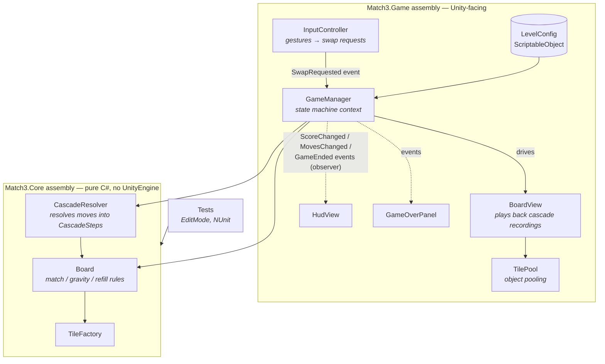
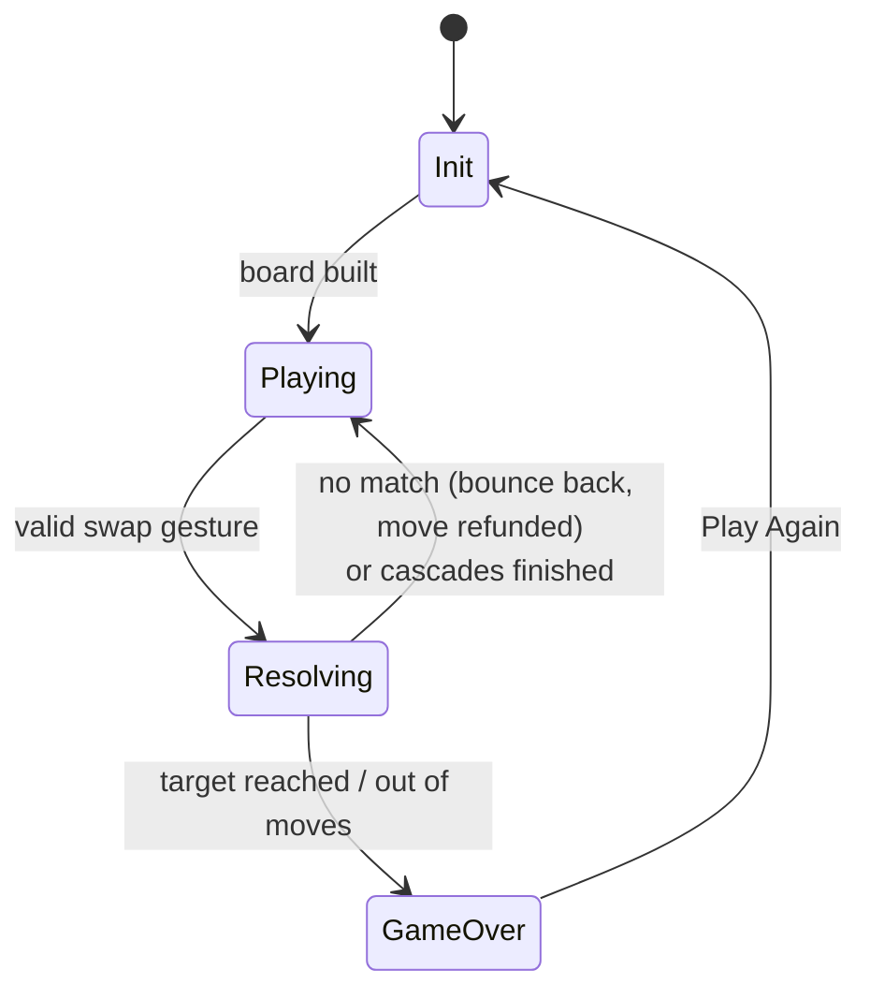

# Match-3 — a small Unity puzzle game built for architecture

A complete, mobile-portrait match-3 (8×8, five colours, 20 moves to reach the target
score, cascade combos with score multipliers) — deliberately small in scope so the
focus stays on **code architecture**: an engine-free C# core with unit tests, a thin
MonoBehaviour view layer, and five classic design patterns used where they pull
their weight.

> 🎬 *gameplay GIF placeholder — record with Cmd+Shift+5 on macOS and drop it here as `docs/gameplay.gif`*

```

```

**Stack:** Unity 2022.3 LTS · 2D URP · TextMeshPro · Unity Test Framework (NUnit) ·
no third-party assets, all "juice" is hand-rolled coroutine tweens.

---

## Architecture

The rule of the codebase: **logic decides, views obey.** All game rules live in
`Match3.Core`, a separate assembly compiled with `noEngineReferences: true` — the
compiler physically rejects `using UnityEngine` there. MonoBehaviours render,
animate and forward input; they never decide anything.



A player move flows one way: `InputController` raises an event → the current
`GameState` validates it → `CascadeResolver` mutates the `Board` and returns a
**recording** (`CascadeStep[]`: what cleared, what fell, what spawned, wave by wave)
→ `BoardView` animates the recording → C# events update the HUD. The view never
re-derives rules, so logic and presentation can't drift apart.

### Game flow (State pattern)



While `Resolving` animates, player input is ignored **without a single boolean
flag** — `ResolvingState` simply doesn't override the input handler.

## Design patterns used (and why)

| Pattern | Where | Why it earns its place |
|---|---|---|
| **State** | `Scripts/Game/States/` | Each phase's behaviour lives in its own class; input-locking during animations falls out for free instead of `if (isBusy)` flags. |
| **Observer** (C# `event`) | `GameManager` → `HudView`, `GameOverPanel` | UI subscribes to score/moves/game-end. GameManager has zero references to UI types — delete the HUD and the game still runs. |
| **Object Pool** | `Scripts/View/TilePool.cs` | Tiles clear and respawn constantly; pooling replaces Instantiate/Destroy churn (GC spikes = dropped frames on mobile) with a stack of reused views. |
| **Factory** | `Scripts/Core/TileFactory.cs` | Single creation point: unique tile IDs for view tracking, injected randomness for deterministic tests, one place to add special tiles later. |
| **ScriptableObject config** | `Scripts/Game/LevelConfig.cs` | Board size, move limit, target score and palette are a data asset — new levels are created in the editor, not in code. |

Two supporting ideas worth noting: **dependency inversion** on randomness
(`IRandom` is injected into the factory, so tests script every dice roll), and
**humble views** (`TileView` knows only "which tile ID am I showing" — all
animation targets come from core data).

## Testing

The core assembly is tested without ever opening a scene — match detection, gravity,
refill, cascade chains and score multipliers, including a fully deterministic
two-wave cascade with scripted random draws.

```
Assets/Tests/EditMode/
├── MatchDetectionTests.cs   runs of 3/4, L-shapes counted once, no false positives
├── BoardTests.cs            no-match initial fill (30 seeds), swap mechanics, factory rules
├── GravityTests.cs          falling, identity preservation, refill stacking
└── CascadeResolverTests.cs  chain reactions, multipliers, board stability after resolve
```

Run them in Unity: **Window → General → Test Runner → EditMode → Run All**.

Because the core is plain C#, the same files also compile and pass under the .NET
SDK with vanilla NUnit — no Unity installation required:

```bash
dotnet test   # using a csproj that links Assets/Scripts/Core + Assets/Tests/EditMode
```

## Project structure

```
Assets/
├── Scripts/
│   ├── Core/        ← Match3.Core.asmdef (noEngineReferences) — Board, CascadeResolver,
│   │                  TileFactory, GridPosition, Tile, ScoreConfig
│   ├── Game/        ← GameManager, LevelConfig, States/ (Init, Playing, Resolving, GameOver)
│   ├── View/        ← BoardView, TileView, TilePool, InputController, CameraFitter
│   └── UI/          ← HudView, GameOverPanel
├── Tests/EditMode/  ← NUnit tests for the core
├── Prefabs/ · Scenes/ · ScriptableObjects/ · Sprites/
```

## Run it

1. Clone, open with Unity 2022.3 LTS via Unity Hub.
2. Follow [SETUP.md](SETUP.md) for the one-time scene/prefab wiring (~20 min,
   written for zero Unity experience).
3. Press Play: drag a tile towards a neighbour to swap. Hit the target score before
   the moves run out.

## Scope cuts (deliberate)

Kept out to keep the codebase reviewable in one sitting: special tiles/boosters,
no-possible-move detection & shuffle, multiple levels, sound, save data. Each has an
obvious seam to grow from (`TileFactory` for special tiles, `LevelConfig` assets for
level progression).
