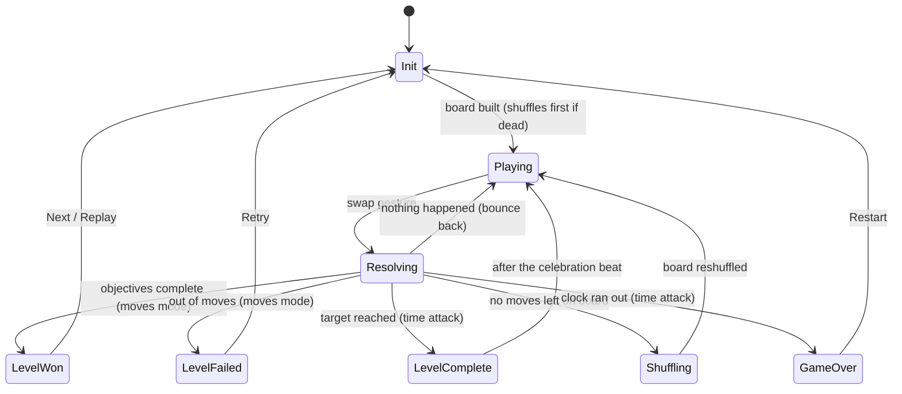

# Candy Match — a Candy-Crush-style match-3 built for architecture

A complete match-3 with **two modes**: a Candy-Crush-style **moves campaign** (20
levels, objectives, special candies, star ratings, saved progress) and the original
**endless time-attack**. Deliberately built so the focus stays on **code
architecture** — an engine-free, unit-tested C# core, a thin MonoBehaviour view
layer, and classic design patterns used where they pull their weight.

> 🎬 *gameplay GIF placeholder — record with Cmd+Shift+5 on macOS and drop it here as `docs/gameplay.gif`*

**Stack:** Unity 2022.3 LTS · 2D URP · TextMeshPro · Unity Test Framework (NUnit) ·
no third-party assets — sprites and sound effects are **procedurally generated**,
all "juice" is hand-rolled coroutine tweens + one runtime-built ParticleSystem.

## Gameplay

### Moves campaign (Candy Crush style — the main mode)

- **20 authored levels** on a scrollable level map, sequentially unlocked, each with
  a **move limit** and **objectives** (reach a score, collect N candies of a colour).
- **Special candies** from match shapes:

  | Shape | Candy | Detonation |
  |---|---|---|
  | 4 in a line | **Striped** (perpendicular) | clears a full row / column |
  | L or T | **Wrapped** | 3×3 blast — **twice** (survives, falls, re-detonates) |
  | 5 in a line | **Colour bomb** | clears every candy of one colour |

- **Special + special swaps:** striped+striped = cross; striped+wrapped = triple
  cross; wrapped+wrapped = two 5×5 blasts; bomb+normal = that colour wiped;
  bomb+striped = that colour *converted to striped and all detonated*;
  bomb+wrapped = colour wipe + double blast; bomb+bomb = **board wipe**.
  Activation swaps never bounce back — a bomb is always a legal move.
- **Chain reactions:** any special caught in a blast goes off too, within the wave.
- **Win** = all objectives complete (unused moves cash out as bonus points *before*
  the 1–3 **star rating**); **lose** = out of moves. Stars and unlocks are **saved**
  (`progress.sav` in `persistentDataPath` — plain `level=stars` lines).

### Time attack (the original endless mode)

Race a countdown to rising score targets; 4+ matches add seconds; endless levels on
the same board. Reachable from the main menu; all its original rules are intact.

Shared by both modes: cascades with rising multipliers, auto-shuffle on dead boards
(a board holding a colour bomb is never dead), idle move hints, drag-to-swap input.

## Architecture

The rule of the codebase: **logic decides, views obey.** All game rules live in
`Match3.Core`, a separate assembly compiled with `noEngineReferences: true` — the
compiler physically rejects `using UnityEngine` there. MonoBehaviours render, animate
and forward input; they never decide anything.

A player move flows one way: `InputController` raises an event → the current
`GameState` validates it → `CascadeResolver.ResolveSwap` mutates the `Board` and
returns a **recording** (`CascadeStep[]`: what cleared, what **morphed into a
special** (`SpecialCreation`), what **detonated** (`Detonation` — kind + area, in
chain order), what fell, what spawned, wave by wave) → `BoardView` animates the
recording (staggered blast pops, converge-and-morph beats) → C# events update the
HUD. The view never re-derives rules, so logic and presentation can't drift apart.

Core rule units, each small and independently tested:

- `Board` — match runs, gravity, refill, possible moves (incl. activation swaps), shuffle
- `SpecialMatchAnalyzer` — match *shape* → which special is born, and in which cell
- `DetonationRules` — pure blast geometry (rows, columns, blasts, colour/board wipes)
- `SwapRules` — classifies special+special / bomb swaps
- `CascadeResolver` — the wave loop: combos → matches → creations → detonation
  worklist (chains, wrapped double-blast) → score → clear/morph → gravity → refill
- `ObjectiveTracker` / `StarCalculator` / `PlayerProgress` — moves-mode win logic & save
- `LevelCurve` — the 20-level difficulty curve (single source for generated assets)
- `CandyArtist` / `SfxSynth` — procedural sprite & sound generation (pure pixel/sample math)

### Game flow (State pattern)



## Design patterns used (and why)

| Pattern | Where | Why it earns its place |
|---|---|---|
| **State** | `Scripts/Game/States/` | Each phase's behaviour and its input/clock rules live in one class; no `if (isBusy)` flags anywhere. |
| **Observer** (C# `event`) | `GameManager` → `HudView`, `LevelResultPanel` | UI subscribes to score / moves / objectives / win / fail / game-over. GameManager has zero references to UI types. |
| **Object Pool** | `TilePool`, `ScorePopup` | Constant clear/respawn churn without Instantiate/Destroy GC spikes. |
| **Factory** | `TileFactory` | Single creation point: unique tile IDs, injected randomness, and the only place special candies are minted. |
| **ScriptableObject config** | `LevelConfig`, `LevelDefinition`, `LevelCatalog`, `CandySpriteLibrary` | Levels, palette, and sprite lookups are data assets. |
| **Strategy-ish rule units** | `SpecialMatchAnalyzer` / `DetonationRules` / `SwapRules` | The resolver stays a loop; the candy rules stay unit-testable functions. |

Two supporting ideas: **dependency inversion** on randomness (`IRandom` is injected
into the factory, shuffle *and* resolver, so tests script every dice roll) and on
persistence (`IProgressRepository`), and **runtime-built UI** (result panel, main
menu, effects, audio) — no fragile scene wiring; each builds itself from code and
`Resources/`.

## Generated assets — no art or audio dependencies

Everything visual/audible ships generated, and can be regenerated inside Unity:

- **Match3 → Generate → Candy Sprites** — 21 PNGs (5 colours × normal/stripedH/
  stripedV/wrapped + colour bomb) drawn by `CandyArtist`: one silhouette per colour
  (circle/square/triangle/diamond/hexagon) so candies stay tellable-apart without
  colour vision.
- **Match3 → Generate → Level Definitions** — the 20 campaign levels + catalog
  from `LevelCurve`.
- **Match3 → Generate → Sound Effects** — 10 WAVs synthesized by `SfxSynth`.
- **Match3 → Setup → Add Scenes To Build** — registers MainMenu + Game scenes.

## Testing

**146 tests, all green** — the core is tested without ever opening a scene:

```
Assets/Tests/EditMode/
├── MatchDetectionTests.cs        runs of 3/4, L-shapes counted once, no false positives
├── BoardTests.cs                 no-match initial fill (30 seeds), swap mechanics, factory rules
├── GravityTests.cs               falling, identity preservation, refill stacking
├── CascadeResolverTests.cs       chain reactions, multipliers, board stability after resolve
├── MatchRunTests.cs              per-run lengths → big-match (4+) detection
├── BoardRecoveryTests.cs         find-a-move, dead boards, colour-preserving shuffle
├── SpecialMatchAnalyzerTests.cs  4/L/T/5 shapes → striped/wrapped/bomb, placement rules
├── DetonationTests.cs            blast geometry + wrapped double-blast + chain order
├── SwapComboTests.cs             all special+special / bomb swaps, no-bounce activation
├── SpecialBoardTests.cs          bombs never colour-match, bomb keeps a board playable
├── ObjectiveTrackerTests.cs      collection/score objectives, star thresholds
└── ProgressTests.cs              save roundtrip, corrupt input, unlocks, level curve
```

Run in Unity via **Window → General → Test Runner → EditMode → Run All**, or
headless without Unity (the core is plain C#):

```bash
dotnet test   # a csproj that links Assets/Scripts/Core + Assets/Tests/EditMode
```

## Project structure

```
Assets/
├── Scripts/
│   ├── Core/        ← Match3.Core.asmdef (noEngineReferences) — board, resolver,
│   │                  special-candy rules, objectives, progress, level curve,
│   │                  CandyArtist + SfxSynth generators
│   ├── Game/        ← GameManager, GameSession, LevelConfig/LevelDefinition/
│   │                  LevelCatalog, AudioManager, ProgressService, States/
│   ├── View/        ← BoardView, TileView, TilePool, InputController,
│   │                  EffectsView, ScorePopup, CameraFitter
│   ├── UI/          ← HudView, LevelResultPanel, MainMenuView (runtime-built)
│   └── Editor/      ← Match3.Editor.asmdef — sprite/level/SFX generators, scene setup
├── Tests/EditMode/  ← NUnit tests for the core
├── Resources/       ← CandySpriteLibrary, LevelCatalog, Levels/, Audio/
├── Prefabs/ · Scenes/ (MainMenu + Game) · ScriptableObjects/ · Sprites/Candies/
```

## Run it

1. Clone, open with Unity 2022.3 LTS via Unity Hub.
2. Open `Assets/Scenes/MainMenu.unity` (or `Game.unity` to jump straight into
   level 1) and press Play. All required assets ship generated; the SETUP.md wiring
   guide is only needed if you rebuild the Game scene from scratch.
3. Drag a candy towards a neighbour to swap. Make 4/L/T/5 shapes for specials, swap
   specials together for combos, finish the objectives before the moves run out.

## Scope cuts (deliberate)

Kept out to leave obvious seams to grow from: **blockers** (jelly/frosting — needs a
per-cell state layer on `Board`), **non-rectangular boards**, **ingredients**,
**boosters/economy**. The objective model (`ObjectiveType` + per-step recording data)
and `TileFactory` are the intended extension points.
