# Candy Match — a Candy-Crush-style match-3 built for architecture

<p align="center">
  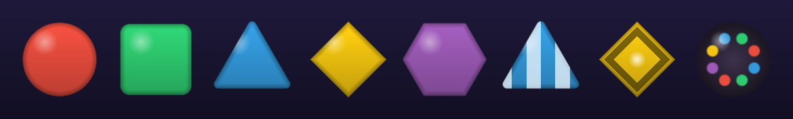
</p>

A complete match-3 with **two modes**: a Candy-Crush-style **moves campaign** (100
levels in five slowly-shifting chapters — objectives, special candies incl. the
2×2 **jelly fish**, jelly, licorice locks, spreading chocolate + **fountains**,
**layered frosting**, **countdown bombs**, beam-eating **swirls**, ingredient
drops, the **Sugar Crush** finale, in-level **boosters**, win-streak head starts,
star ratings, a **star chest** + **daily missions** economy, a buildable candy
town, daily streak rewards, one-line **tutorial overlays**, a relaxed mode +
accessibility switches, saved + cloud-synced progress, generative chapter music)
and the original **endless time-attack** with an online leaderboard. Deliberately
built so the focus stays on **code architecture** — an engine-free, unit-tested
C# core, a thin MonoBehaviour view layer, and classic design patterns used where
they pull their weight.

<p align="center">
  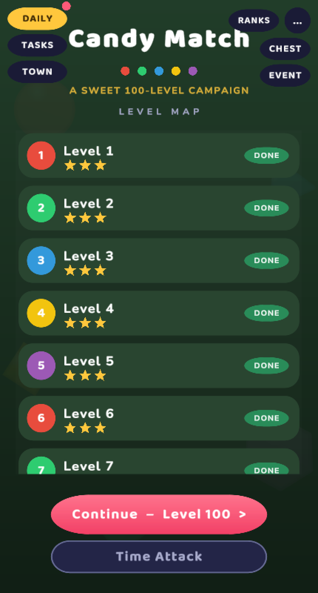
  &nbsp;
  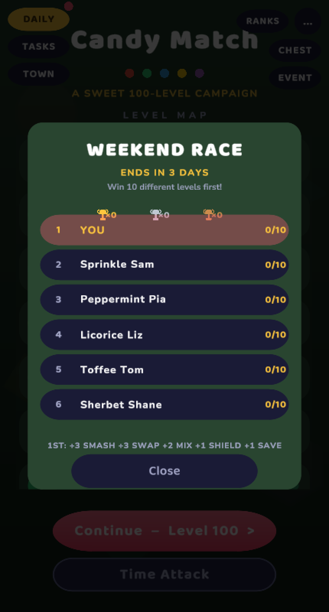
  &nbsp;
  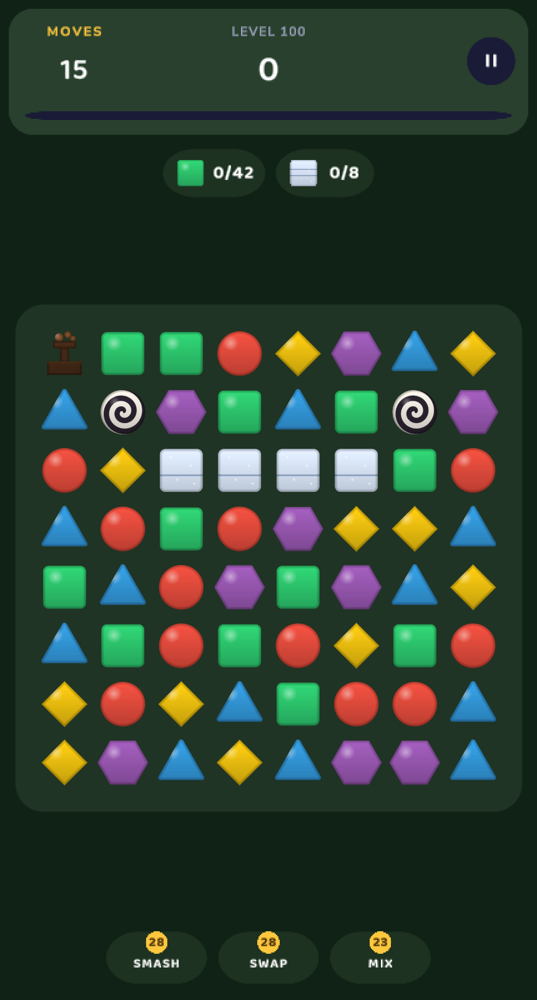
  &nbsp;
  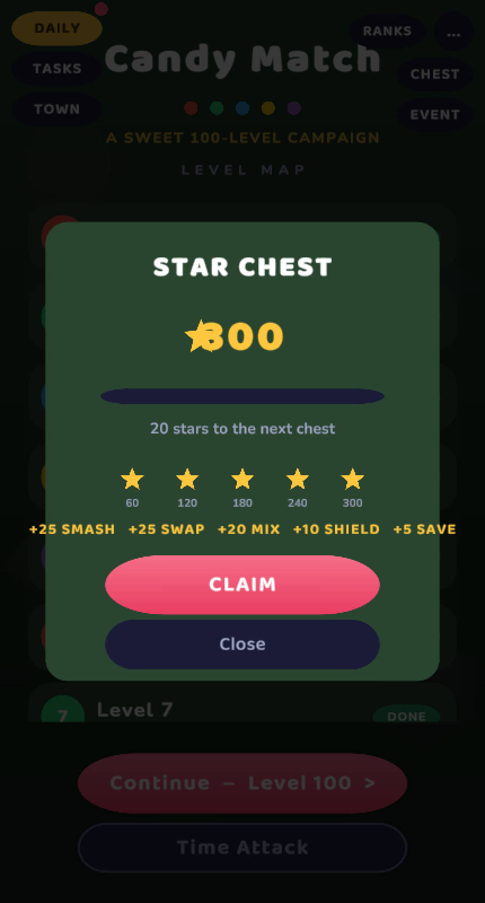
  &nbsp;
  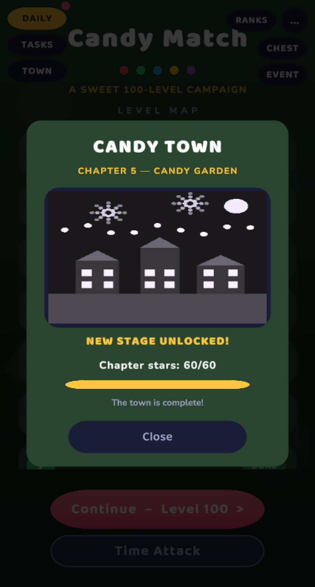
  &nbsp;
  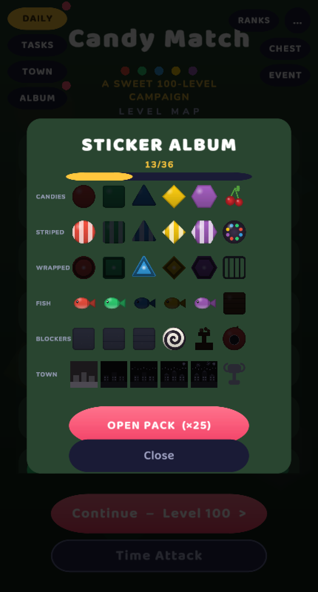
</p>
<p align="center"><sub><i>Straight from the game: the level map, the <b>weekend race</b> with its seeded bot racers, the all-blockers <b>level-100 finale</b>, a 20-chest <b>star-chest</b> payout, <b>Candy Town</b> at full build, and the <b>sticker album</b>.</i></sub></p>

<p align="center">
  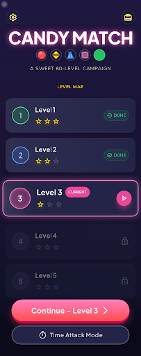
  &nbsp;
  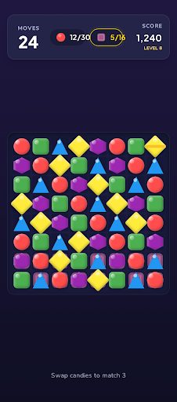
  &nbsp;
  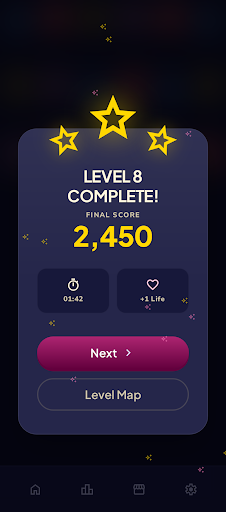
</p>
<p align="center"><sub><i>UI design previews (Stitch + Figma) — the game builds this exact language at runtime, no scene wiring.</i></sub></p>

**The ambience drifts with the campaign** — every 20-level chapter slides towards a
new palette (purple night → ocean teal → dusk plum → warm ember → golden dawn →
candy garden), one gentle step per level, and each chapter hums its own
**procedurally composed music loop**:

<p align="center">
  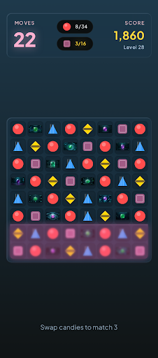
  &nbsp;
  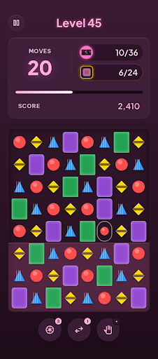
</p>

> 🎬 *gameplay GIF placeholder — record with Cmd+Shift+5 on macOS and drop it here as `docs/gameplay.gif`*

**Stack:** Unity 2022.3 LTS · 2D URP · TextMeshPro · Unity Test Framework (NUnit) ·
Unity Gaming Services (optional, anonymous auth + cloud save + leaderboards) ·
no third-party assets — candy sprites, UI chrome, sound effects **and the music**
are all **procedurally generated**, the UI implements a Figma-authored design
language (Baloo 2 + Nunito), and all "juice" is hand-rolled coroutine tweens + one
runtime-built ParticleSystem. Mobile-hardened: safe-area aware, 60 fps capped,
pooled everything, virtualized level list, pause/settings with persisted options,
haptics, and a colorblind sprite mode.

## Gameplay

### Moves campaign (Candy Crush style — the main mode)

- **100 authored levels** on a scrollable (virtualized) level map, sequentially
  unlocked, each with a **move limit** and **objectives** shown as icon chips over
  the board: reach a score, collect N candies of a colour, **clear all the jelly**,
  **crush the chocolate**, **peel the frosting**, or **bring the ingredients home**.
- **Chapters that drift, never jump.** Every 20 levels is a chapter with its own
  ambience — purple night → ocean teal → dusk plum → warm ember — and each level
  interpolates 1/20th of the way towards the next palette (`ThemeCurve`, unit-tested
  to never shift a colour channel more than 0.02 per level) while `MusicComposer`'s
  chapter loop crossfades underneath. Difficulty repeats the chapter rhythm one
  notch harder; candy colours and controls never change.
- **Jelly blockers** (from level 8): translucent cells under the candies, in one or
  two layers. A match on a jelly cell peels one layer; jelly sticks to the CELL, so
  candies fall through it. Late levels widen the jelly and double its layers.
- **Chapter 4 blockers** (levels 61–80, taught in five-level acts):
  **licorice locks** pin their candy — a hit breaks the cage, the candy survives,
  and gravity treats the cell as a floor; **chocolate** is immobile, crumbles next
  to any clear, and *eats a neighbouring candy* at the end of every move that
  ignored it; **ingredients** are indestructible colourless pieces that trickle in
  through refills and score when they reach the bottom row.
- **Chapter 5 blockers** (levels 81–100, same act rhythm): **layered frosting**
  (1–3 layers; adjacent matches and blasts peel one per wave — the last layer lets
  the clear through); **countdown bombs** — coloured candies on a move fuse, match
  them or lose (boosters and shuffles never burn the fuse); **licorice swirls**
  that fall like candy but *absorb striped beams* (the ray stops, cells behind
  survive); and the indestructible **chocolate fountain**, which revives the
  spread even after the last chocolate dies. The finale act runs two moves tighter.
- **The jelly fish** — the 2×2 square match (a dead shape in most match-3s) mints
  a fish that darts at the board's most urgent target: jelly → frosting →
  chocolate → swirl → a random candy. Fish+fish = a school of three; fish+striped
  and fish+wrapped carry the partner's blast to every target; bomb+fish strikes
  two rounds.
- **Sugar Crush finale:** winning converts leftover moves into striped candies
  (4 per 5 moves) and fires every special on the board — with finale bonuses
  (striped/fish 500, wrapped 1000, colour bomb 5000) raining into the score.
- **Boosters** (SMASH hammer / free SWAP / MIX shuffle): tray at the bottom,
  never cost a move, starter pack of 3 each, refilled by streak days, chests and
  missions. Hidden in time attack — the leaderboard stays pure.
- **Win streak ("Butler's Gift"):** consecutive wins pre-load specials on the next
  board (striped → +wrapped → +colour bomb); abandoning a level breaks the streak,
  and chest-earned **streak shields** can absorb one loss.
- **Star chest + daily missions:** every 20 stars opens a booster chest (milestone
  chests pay more); three deterministic daily missions + one weekly ride along on
  the cascade recording — no separate counters to desync.
- **Candy Town:** total stars silently build a five-stage night town per chapter —
  a decor meta with zero choices to grind.
- **Tutorial overlays:** each act opener dims the board once, rings the mechanic's
  cells in pulsing gold and says one short line ("A 2X2 MAKES A FISH"); the first
  tap dismisses it.
- **Relaxed mode + accessibility:** effectively unlimited moves (wins cap at one
  star, so the economy holds), reduced-motion and big-text switches, and the
  colorblind sprite badges — all in Settings.
- **Daily streak rewards:** a 7-day calendar (menu → DAILY) of extra-moves and
  special-candy head starts, with local "your treat is ready / streak about to
  melt" notifications — fully offline, clock-rollback safe.
- **Candy Calendar (menu → EVENT):** fully local time-limited events on a weekly
  beat — Tue–Thu runs a 3-day objective event (Candy Rush / Specialist Week /
  Blocker Bash / Star Sprint, three claimable reward tiers), Fri–Sun runs the
  **weekend race**: five seeded bot racers who advance only when you win a
  distinct level; first to 10 wins takes the podium, and podium finishes mint
  permanent gold/silver/bronze **trophies**. Mondays are deliberately quiet.
  Everything derives from the day number (no server): a clock pulled backwards
  freezes the event, and rewards you earned but never claimed are **auto-banked
  into your inventory** when the next window opens — generosity over deadlines.
- **Special candies** from match shapes:

  | Shape | Candy | Detonation |
  |---|---|---|
  | 4 in a line | **Striped** (perpendicular) | clears a full row / column (a beam — swirls absorb it) |
  | L or T | **Wrapped** | 3×3 blast — **twice** (survives, falls, re-detonates) |
  | 5 in a line | **Colour bomb** | clears every candy of one colour |
  | 2×2 square | **Jelly fish** | darts at the most urgent cell (jelly → blockers → random) |

- **Special + special swaps:** striped+striped = cross; striped+wrapped = triple
  cross; wrapped+wrapped = two 5×5 blasts; bomb+normal = that colour wiped;
  bomb+striped = that colour *converted to striped and all detonated*;
  bomb+wrapped = colour wipe + double blast; bomb+bomb = **board wipe**.
  Activation swaps never bounce back — a bomb is always a legal move.
- **Chain reactions:** any special caught in a blast goes off too, within the wave.
- **Win** = all objectives complete (unused moves cash out as bonus points *before*
  the 1–3 **star rating**); **lose** = out of moves (or a bomb goes off). Stars and
  unlocks are **saved** (`progress.sav` in `persistentDataPath` — plain
  `level=stars` lines).
- **Sticker album (menu → ALBUM):** a six-page collection of the game's own
  bestiary — candies, specials, fish, blockers, the town, the trophy — filled by
  opening **packs** earned from stars (one per ten, retroactively — veterans get
  a launch splash), chests, weekly missions and event podiums. Deterministic
  per-save rolls with a **pity ladder** that guarantees completion; dupes pay
  boosters; page completions pay bundles and finishing everything earns the
  permanent **golden cover**. No purchases, ever.
- **Rescues (free continues):** the fail panel can offer *SAVE ME — +5 moves*
  (on a bomb loss: *DEFUSE* — every short fuse is re-armed too) for one **Rescue**
  from your shelf. One per attempt, no purchases ever: you start with 2 and earn
  more from star-chest milestones, weekly missions and weekend-race podiums. A
  rescued level never counts as a loss — win it and your streak lives on.

### Time attack (the original endless mode)

Race a countdown to rising score targets; 4+ matches add seconds; endless levels on
the same board. Reachable from the main menu — and its scores feed an **online
leaderboard** (menu → RANKS) where every submission passes a **Cloud Code
plausibility check** server-side (`ScoreBounds`: no run may score faster than
physically possible).

Shared by both modes: cascades with rising multipliers, auto-shuffle on dead boards
(a board holding a colour bomb is never dead), idle move hints, drag-to-swap input,
a pause/settings overlay (music + SFX + haptics + colorblind + reminders, all
persisted), and Android back-button handling.

### Cloud sync (optional, free)

With the Unity Gaming Services packages installed and a project linked
(`docs/UGS-SETUP.md`, no credit card), the game signs in **anonymously** at boot
and syncs progress: per-level **max-stars merging** (`ProgressMerger`, a CRDT-style
join — no sync order or retry can ever lose progress). The game is strictly
**local-first**: nothing ever blocks the menu, and every cloud failure silently
degrades to local-only play.

## Architecture

The rule of the codebase: **logic decides, views obey.** All game rules live in
`Match3.Core`, a separate assembly compiled with `noEngineReferences: true` — the
compiler physically rejects `using UnityEngine` there. MonoBehaviours render, animate
and forward input; they never decide anything.

A player move flows one way: `InputController` raises an event → the current
`GameState` validates it → `CascadeResolver.ResolveSwap` mutates the `Board` and
returns a **recording** (`CascadeStep[]`: what cleared, what **morphed into a
special** (`SpecialCreation`), what **detonated** (`Detonation` — kind + area, in
chain order), which **jelly layers came off** (`JellyHit`), what fell, what spawned,
wave by wave) → `BoardView` animates the recording (staggered blast pops,
converge-and-morph beats, jelly pops) → C# events update the HUD. The view never
re-derives rules, so logic and presentation can't drift apart.

Core rule units, each small and independently tested:

- `Board` — match runs **and 2×2 squares**, gravity (immobile cells act as
  floors), refill, possible moves (incl. activation swaps), immobile-preserving
  shuffle, a square-free initial fill
- `JellyGrid` / `LockGrid` / `FrostingGrid` / `BombTimers` — the blocker ledgers;
  matches damage jelly, break locks and peel frosting layers; bomb countdowns key
  by tile id (positions go stale under gravity) and tick only on counted moves
- `SpecialMatchAnalyzer` — match *shape* → which special is born, and in which cell
- `DetonationRules` — pure blast geometry (rows, columns, blasts, colour/board wipes)
- `SwapRules` — classifies special+special / bomb swaps
- `CascadeResolver` — the wave loop: combos → matches → creations → detonation
  worklist (chains, wrapped double-blast) → lock absorption → chocolate crumble →
  ingredient exits → jelly damage → score → clear/morph → gravity → refill (+
  ingredient injection), and the end-of-move chocolate spread
- `ObjectiveTracker` / `StarCalculator` / `PlayerProgress` / `ProgressMerger` —
  moves-mode win logic, save, and the conflict-free cloud merge
- `DailyStreak` / `MetaState` — the login-streak rules and their tolerant save format
- `LevelCurve` / `ThemeCurve` — the 100-level difficulty curve (chapter-4 and
  chapter-5 blocker acts + tutorial lines included) and the per-chapter ambience
  drift (single source for generated assets and runtime tinting)
- `CandyArtist` / `UiArtist` / `SfxSynth` / `MusicComposer` — procedural candy
  sprites, UI chrome, sounds and loop-perfect chapter music (pure pixel/sample
  math, no engine types; the music wraps note tails around the loop seam)

### Game flow (State pattern)

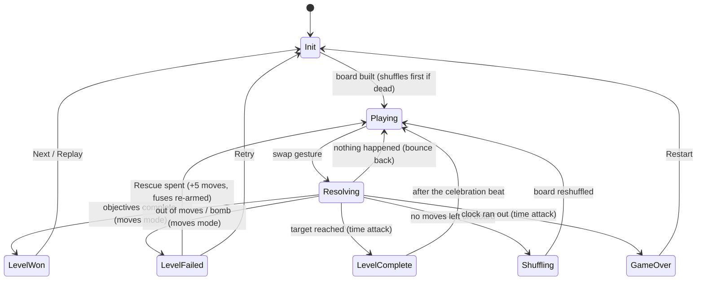
```mermaid
stateDiagram-v2
    [*] --> Init
    Init --> Playing : board built (shuffles first if dead)
    Playing --> Resolving : swap gesture
    Resolving --> Playing : nothing happened (bounce back)
    Resolving --> LevelWon : objectives complete (moves mode)
    Resolving --> LevelFailed : out of moves / bomb (moves mode)
    Resolving --> LevelComplete : target reached (time attack)
    Resolving --> Shuffling : no moves left on board
    Resolving --> GameOver : clock ran out (time attack)
    LevelComplete --> Playing : after the celebration beat
    Shuffling --> Playing : board reshuffled
    LevelWon --> Init : Next / Replay
    LevelFailed --> Playing : Rescue spent (+5 moves, fuses re-armed)
    LevelFailed --> Init : Retry
    GameOver --> Init : Restart
```

## Design patterns used (and why)

| Pattern | Where | Why it earns its place |
|---|---|---|
| **State** | `Scripts/Game/States/` | Each phase's behaviour and its input/clock rules live in one class; no `if (isBusy)` flags anywhere. |
| **Observer** (C# `event`) | `GameManager` → `HudView`, `LevelResultPanel` | UI subscribes to score / moves / objectives / win / fail / game-over. GameManager has zero references to UI types. |
| **Object Pool** | `TilePool`, `ScorePopup` | Constant clear/respawn churn without Instantiate/Destroy GC spikes. |
| **Factory** | `TileFactory` | Single creation point: unique tile IDs, injected randomness, and the only place special candies are minted. |
| **ScriptableObject config** | `LevelConfig`, `LevelDefinition`, `LevelCatalog`, `CandySpriteLibrary` | Levels, palette, and sprite lookups are data assets. |
| **Strategy-ish rule units** | `SpecialMatchAnalyzer` / `DetonationRules` / `SwapRules` | The resolver stays a loop; the candy rules stay unit-testable functions. |

Two supporting ideas: **dependency inversion** on randomness (`IRandom` is injected
into the factory, shuffle *and* resolver, so tests script every dice roll) and on
persistence (`IProgressRepository`), and **runtime-built UI** (result panel, main
menu, objective chips, HUD card, effects, audio) — no fragile scene wiring; each
builds itself from code and `Resources/`.

## Design language

The UI implements a Figma-authored design ("Candy Match — Game UI"): a deep
purple-navy gradient, rounded cards, pill CTAs with a pink gradient, gold star
pips, and a **Baloo 2 / Nunito** type pairing (TTFs ship in `Resources/Fonts`,
turned into TMP font assets at runtime). The whole language lives in one code
surface — [`UiTheme`](Assets/Scripts/UI/UiTheme.cs) mirrors the Figma colour
variables, fonts and generated sprites, so restyling the game is a one-file edit.

## Game feel — the juice layer

All animation is hand-rolled coroutine tweening (no DOTween, no packages), built
on a small shared vocabulary — swap 0.18s, pop 0.25s, overshoot-to-1.25 pops,
SmoothStep easing, pitch ladders that climb with cascade depth:

- **Board feel** — candies *fall* with a quadratic ease-in and land with a squash
  + overshoot; touched tiles press down and pop back; an invalid swap answers
  with a low-pitch thunk and a head-shake wiggle. Special candies breathe with a
  phase-offset shimmer (transform-only: zero extra draw calls); deep cascades pop
  **SWEET! → TASTY! → DIVINE! → DELICIOUS!** banners; striped blasts sweep lane
  beams whose tip rides the same stagger as the cell pops, wrapped blasts ring,
  colour bombs crackle tendrils to their victims.
- **Screens** — panels fade + soft-pop open through one kit
  ([`UiTween`](Assets/Scripts/UI/UiTween.cs), all unscaled time so the pause
  panel animates at `timeScale 0`), every runtime button squeezes on press, the
  HUD score bar glides, levels open with a diagonal grow-in curtain, and scene
  changes ride a `ScreenFader` curtain that eats double-taps. Wins get the full
  ceremony: card pop → stars → UI-space confetti (one driver coroutine, zero
  per-burst allocs) → a 0→score count-up, while cleared-goal sparks fly from the
  board to their objective chips.
- **The view stays rule-free** — everything above derives from the resolver's
  recordings (`Detonation.Origin/Kind/Area`, `CascadeIndex`, tracker deltas); no
  gameplay fact is ever recomputed in the view layer. **Reduced Motion** turns
  scale beats instant, halves informative fades, and skips shakes, wiggles,
  beams, flyers and most confetti.

## Generated assets — no art or audio dependencies

Everything visual/audible ships generated, and can be regenerated inside Unity:

- **Match3 → Generate → Candy Sprites** — 74 PNGs drawn by `CandyArtist`: 5 colours
  × normal/stripedH/stripedV/wrapped/**fish**/**bomb**, the same set again with
  **colorblind glyph badges**, the colour bomb, chocolate, the ingredient
  cherries, the licorice cage, the **frosting stack (3 thicknesses)**, the
  **swirl**, the **chocolate fountain** and the five candy-town stages. One
  silhouette per colour so candies stay tellable-apart without colour vision even
  before the badge mode.
- **Match3 → Generate → UI Sprites** — the design's chrome from `UiArtist`:
  9-slice rounded cards and pills (+outline rings), star, padlock, circle, and the
  baked background/CTA gradients.
- **Match3 → Generate → Level Definitions** — the 100 campaign levels + catalog
  from `LevelCurve` (jelly, locks, chocolate, frosting, swirls, fountains, bombs,
  ingredient counts and tutorial lines included).
- **Match3 → Generate → Sound Effects** — 10 WAVs synthesized by `SfxSynth`.
- **Match3 → Generate → Music** — one loop-perfect stereo track per chapter from
  `MusicComposer` (deterministic: same chapter, same bytes).
- **Match3 → Generate → Sprite Atlas / Font Assets** — the candy atlas (draw-call
  batching) and pre-baked TMP SDF fonts (no runtime rasterization hitches).
- **Match3 → Setup → Apply Mobile Settings** — portrait lock, IL2CPP + ARM64,
  safe-area flag, vSync off on every tier, URP HDR/shadows off, Android ASTC
  texture overrides, mono SFX.
- **Match3 → Setup → Add Scenes To Build** — registers MainMenu + Game scenes.

## Testing

**476 EditMode tests, all green** — the core is tested without ever opening a scene:

```
Assets/Tests/EditMode/
├── MatchDetectionTests.cs        runs of 3/4, L-shapes counted once, no false positives
├── BoardTests.cs                 no-match initial fill (30 seeds), swap mechanics, factory rules
├── GravityTests.cs               falling, identity preservation, refill stacking
├── CascadeResolverTests.cs       chain reactions, multipliers, board stability after resolve
├── MatchRunTests.cs              per-run lengths → big-match (4+) detection
├── BoardRecoveryTests.cs         find-a-move, dead boards, colour-preserving shuffle
├── SpecialMatchAnalyzerTests.cs  4/L/T/5 shapes → striped/wrapped/bomb, placement rules
├── DetonationTests.cs            blast geometry + wrapped double-blast + chain order
├── SwapComboTests.cs             all special+special / bomb swaps, no-bounce activation
├── SpecialBoardTests.cs          bombs never colour-match, bomb keeps a board playable
├── ObjectiveTrackerTests.cs      collection/score objectives, star thresholds
├── JellyTests.cs                 jelly damage/recording, double layers, morph-cell hits, curve
├── LockTests.cs                  lock absorption, dormant locked specials, gravity floors,
│                                 pinned shuffles, dead-board detection, jelly shielding
├── ChocolateTests.cs             adjacent crumbling, deterministic spread, spread suppression,
│                                 immobility, no spread without a player move
├── IngredientTests.cs            fall-and-exit flow, blast immunity, refill injection budget
├── FishTests.cs                  2×2 shape priority, target priority, the fish combo matrix
├── BlockerTests.cs               frosting layers, bomb fuses (birth-move grace), swirl beam
│                                 absorption, fountain revival — and their recordings
├── Chapter5Tests.cs              level 81-100 landmarks, tutorial lines, 1-80 bit-identical
├── FinaleTests.cs                Sugar Crush conversions, determinism, finale score bonuses
├── BoosterTests.cs               inventory roundtrip, hammer/free-swap/shuffle behaviour
├── WinStreakTests.cs             streak growth/reset, structural abandon, preload ladder
├── EconomyTests.cs               star chest math, town stages, shields, mission determinism
├── EventTests.cs                 candy-calendar windows, clock-rollback freeze, race bots,
│                                 rollover banking, tier claims (the freeze's first real coverage)
├── RescueTests.cs                rescue mints and spends, fuse re-arming, deferred streak break
├── DailyStreakTests.cs           streak rules (rollback-safe), 7-day reward cycle, meta roundtrip
├── MusicComposerTests.cs         byte determinism, exact bar lengths, stereo PCM headers
├── ProgressMergerTests.cs        max-stars merge, order independence, ScoreBounds pinning
├── ThemeCurveTests.cs            chapter anchors, drift-rate bound, 100-level campaign rhythm,
│                                 blocker acts, early-chapter immutability landmarks
└── ProgressTests.cs              save roundtrip, corrupt input, unlocks, level curve
```

Plus **3 PlayMode smoke tests** (`Assets/Tests/PlayMode/SceneSmokeTests.cs`) that
boot the real scenes: the Game scene builds a full match-free board in Moves mode
with the runtime UI attached, TimeAttack starts with a running clock, and the
MainMenu builds its level map. These catch what unit tests can't — broken
scene references, missing Resources assets, lifecycle ordering.

Run in Unity via **Window → General → Test Runner** (EditMode and PlayMode tabs),
or headless without Unity (the core is plain C#):

```bash
dotnet test   # a csproj that links Assets/Scripts/Core + Assets/Tests/EditMode
```

## Project structure

```
Assets/
├── Scripts/
│   ├── Core/        ← Match3.Core.asmdef (noEngineReferences) — board, jelly grid,
│   │                  resolver, special-candy rules, objectives, progress, level
│   │                  curve, CandyArtist + UiArtist + SfxSynth generators
│   ├── Game/        ← GameManager, GameSession, LevelConfig/LevelDefinition/
│   │                  LevelCatalog, AudioManager, ProgressService, States/
│   ├── View/        ← BoardView (incl. jelly overlay), TileView, TilePool,
│   │                  InputController, EffectsView, ScorePopup, CameraFitter
│   ├── UI/          ← UiTheme + HudView, ObjectiveBarView, LevelResultPanel,
│   │                  MainMenuView (all runtime-built)
│   └── Editor/      ← Match3.Editor.asmdef — sprite/UI/level/SFX generators, scene setup
├── Tests/EditMode/  ← NUnit tests for the core (dotnet-runnable)
├── Tests/PlayMode/  ← scene-boot smoke tests
├── Resources/       ← CandySpriteLibrary, LevelCatalog, Levels/, Audio/, Fonts/, UI/
├── Prefabs/ · Scenes/ (MainMenu + Game) · ScriptableObjects/ · Sprites/Candies/
```

## Run it

1. Clone, open with Unity 2022.3 LTS via Unity Hub.
2. Open `Assets/Scenes/MainMenu.unity` (or `Game.unity` to jump straight into
   level 1) and press Play. All required assets ship generated; the SETUP.md wiring
   guide is only needed if you rebuild the Game scene from scratch.
3. Drag a candy towards a neighbour to swap. Make 4/L/T/5 shapes for specials, swap
   specials together for combos, finish the objectives before the moves run out.

## Scope cuts (deliberate)

Kept out to leave obvious seams to grow from: **non-rectangular boards**,
**account linking** (cloud identity is anonymous-only for now), and **any form of
monetization** — no lives, no purchases; the rescue/continue economy is earned,
never bought. Locks, chocolate, ingredients, the chapter-5 blockers, the booster
kit, the candy calendar and the rescues all landed through the seams the jelly
layer established — a state grid or tile kind beside the board, a per-step
recording list, an append-only enum — which is exactly how the next mechanic
should arrive too.
